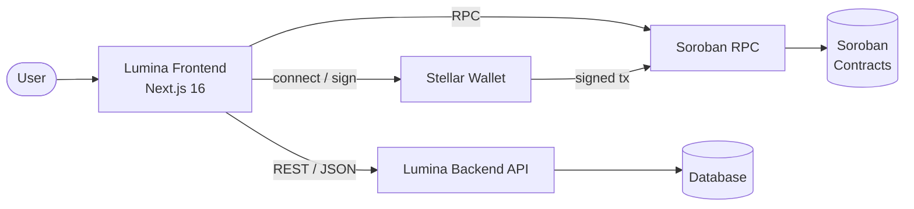

# Lumina Frontend

Next.js 16 web application for the Lumina Network, a blockchain-based vesting vault and token streaming platform built on Stellar Soroban.

[](https://github.com/stellar-network-builders/lumina-frontend/actions/workflows/test.yml)

## Overview

Lumina Frontend is the user-facing dashboard for Lumina's on-chain vesting infrastructure. It lets users create and manage vesting schedules, participate in governance, track token streams, and view real-time analytics. The application is built with the Next.js App Router and talks to a Node.js backend API and to Stellar Soroban smart contracts.

## Architecture at a glance



The frontend never holds private keys. Read traffic flows to the backend API and to Soroban RPC, while any state-changing transaction is built client-side, signed by the user's wallet, and submitted to the network. See [docs/ARCHITECTURE.md](docs/ARCHITECTURE.md) for the full picture.

## Tech stack

| Layer | Technology |
|-------|-----------|
| Framework | [Next.js 16](https://nextjs.org/) (App Router, Turbopack) |
| Language | [TypeScript 5](https://www.typescriptlang.org/) |
| Styling | [Tailwind CSS v4](https://tailwindcss.com/) |
| Linting | [ESLint 9](https://eslint.org/) with `eslint-config-next` |
| Blockchain | [Stellar Soroban](https://stellar.org/) smart contracts |
| Runtime | [React 19](https://react.dev/) |

## Prerequisites

- **Node.js 20.9 or newer** (required by Next.js 16; the CI pipeline builds on Node 20)
- **npm 10 or newer** (ships with Node 20+)
- A Stellar wallet for testing on-chain flows, for example [Freighter](https://www.freighter.app/)

Check your versions:

```bash
node --version
npm --version
```

## Quick start

Five steps from clone to running locally:

```bash
# 1. Clone the repository
git clone https://github.com/stellar-network-builders/lumina-frontend.git
cd lumina-frontend

# 2. Install dependencies
npm install

# 3. Create your local environment file
cp .env.example .env.local

# 4. Start the development server
npm run dev

# 5. Open the app
# Visit http://localhost:3000
```

## Environment variables

All client-exposed variables are prefixed with `NEXT_PUBLIC_` so that Next.js inlines them into the browser bundle. Copy `.env.example` to `.env.local` and fill in the values for your environment.

| Variable | Required | Default | Description |
|----------|----------|---------|-------------|
| `NEXT_PUBLIC_API_URL` | Yes | `http://localhost:4000` | Base URL of the Lumina backend API. |
| `NEXT_PUBLIC_SOROBAN_RPC_URL` | Yes | `https://soroban-testnet.stellar.org` | Soroban RPC endpoint used for contract reads and transaction submission. |
| `NEXT_PUBLIC_NETWORK` | Yes | `testnet` | Active Stellar network: `testnet`, `futurenet`, or `mainnet`. |
| `NEXT_PUBLIC_SENTRY_DSN` | No | empty | Sentry DSN for client-side error reporting. Leave empty to disable. |
| `NEXT_PUBLIC_WALLET_CONNECT_PROJECT_ID` | No | empty | WalletConnect project ID for wallet sessions. |

See the [Next.js environment variables guide](https://nextjs.org/docs/app/building-your-application/configuring/environment-variables) for how values are resolved across `.env`, `.env.local`, and deployment settings.

> Anything prefixed with `NEXT_PUBLIC_` is visible to the browser. Never put secrets behind that prefix.

## npm scripts

| Command | Description |
|---------|-------------|
| `npm run dev` | Start the development server with hot reload at `http://localhost:3000`. |
| `npm run build` | Create an optimized production build. |
| `npm start` | Serve the production build (run `npm run build` first). |
| `npm run lint` | Run ESLint across the project. |

## Project structure

```
lumina-frontend/
├── app/                  # Next.js App Router: routes, layouts, pages
│   ├── layout.tsx        # Root layout (fonts, global shell)
│   ├── page.tsx          # Home page
│   ├── globals.css       # Global styles and Tailwind theme tokens
│   └── favicon.ico       # App favicon
├── public/               # Static assets served as-is
├── docs/                 # Developer documentation (see below)
│   └── diagrams/         # Mermaid source for architecture diagrams
├── .github/workflows/    # CI pipelines
├── .env.example          # Template for local environment variables
├── next.config.ts        # Next.js configuration
├── tsconfig.json         # TypeScript configuration
├── eslint.config.mjs     # ESLint flat config
└── postcss.config.mjs    # PostCSS / Tailwind configuration
```

## Documentation

| Document | What it covers |
|----------|----------------|
| [docs/ARCHITECTURE.md](docs/ARCHITECTURE.md) | System architecture, data flow, and component hierarchy. |
| [docs/WALLET_INTEGRATION.md](docs/WALLET_INTEGRATION.md) | Wallet connection, the SEP-10 auth flow, and network handling. |
| [docs/API_INTEGRATION.md](docs/API_INTEGRATION.md) | Backend API client, query keys, and mutation hooks. |
| [docs/SOROBAN_INTEGRATION.md](docs/SOROBAN_INTEGRATION.md) | Contract addresses per network, query patterns, and transaction flow. |
| [docs/COMPONENT_GUIDE.md](docs/COMPONENT_GUIDE.md) | UI component library, the variant system, and theming. |
| [docs/STATE_MANAGEMENT.md](docs/STATE_MANAGEMENT.md) | Zustand stores, React Query patterns, and when to use each. |
| [docs/TESTING.md](docs/TESTING.md) | Unit, component, and end-to-end testing strategy. |
| [docs/DEPLOYMENT.md](docs/DEPLOYMENT.md) | Deployment, environment promotion, and rollback procedures. |
| [CONTRIBUTING.md](CONTRIBUTING.md) | PR workflow, commit conventions, and code style. |
| [CHANGELOG.md](CHANGELOG.md) | Release history following Keep a Changelog. |

## Contributing

Contributions are welcome. Read [CONTRIBUTING.md](CONTRIBUTING.md) for the branch naming convention, conventional commit format, and the PR checklist before opening a pull request.

## Related repositories

- [lumina-core](https://github.com/stellar-network-builders/lumina-core), Soroban smart contracts
- [lumina-backend](https://github.com/stellar-network-builders/lumina-backend), Node.js API and services

## License

This project is part of the Lumina Network. See the upstream repository for license details.
