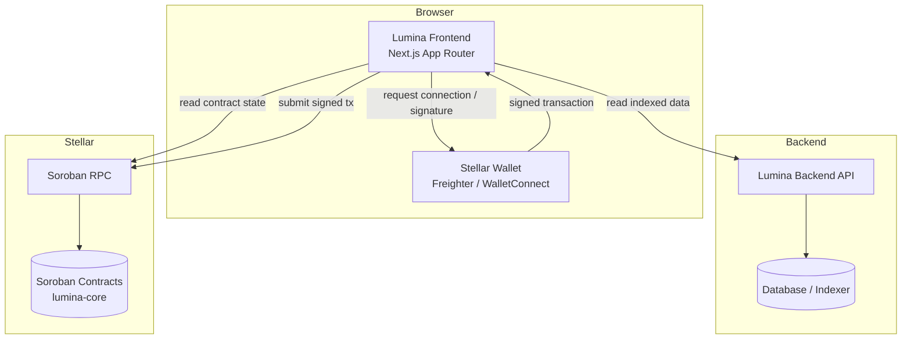
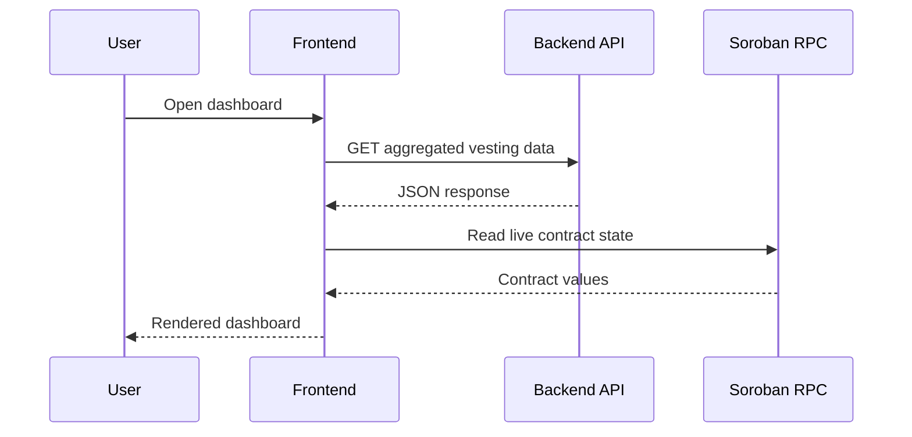
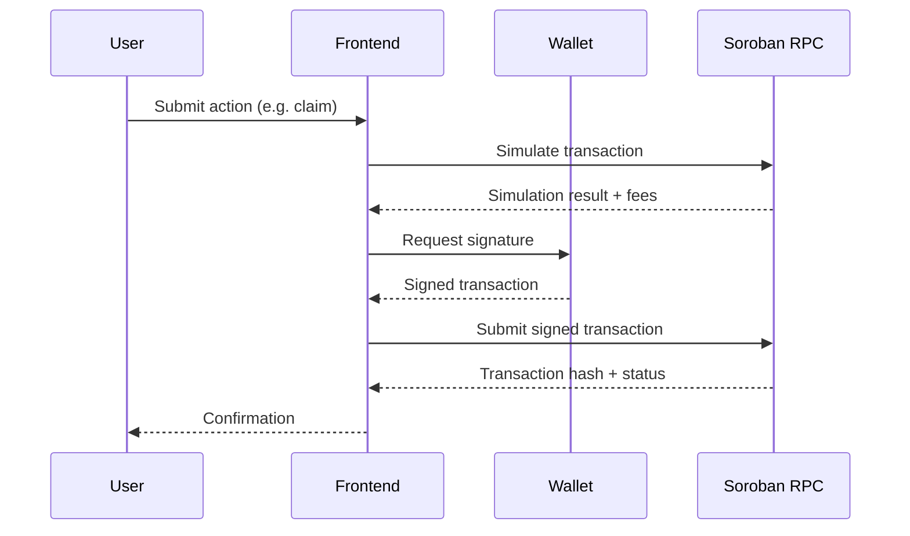
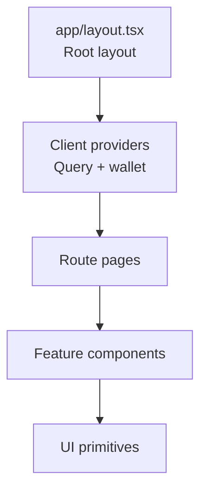

# Architecture

This document explains how Lumina Frontend is structured, how data flows through the system, and how the application connects to the backend API and to Stellar Soroban contracts.

## System overview

Lumina Frontend is a Next.js 16 App Router application. It is one of three repositories that make up the Lumina Network:

- **lumina-frontend** (this repo): the web dashboard.
- **lumina-backend**: the Node.js API that serves indexed data and off-chain services.
- **lumina-core**: the Soroban smart contracts that hold on-chain state.

## Design principles

1. **Non-custodial.** The frontend never sees or stores private keys. Signing always happens inside the user's wallet.
2. **Read from the fastest source.** Aggregated or historical data is read from the backend API, which indexes chain events. Live contract state is read directly from Soroban RPC.
3. **Server Components by default.** Rendering happens on the server unless a component needs interactivity, in which case it opts in with `"use client"`.
4. **Typed boundaries.** Every external boundary (API responses, contract return values) is given an explicit TypeScript type so changes surface at compile time.

## Data flow

### Reads

### Writes (transactions)

## Layered structure

The application is organized in layers, from the route surface down to external integrations. As features are added, code is expected to land in these layers:

| Layer | Location | Responsibility |
|-------|----------|----------------|
| Routes | `app/` | Pages, layouts, and route handlers (App Router). |
| UI components | `components/` | Reusable presentational and interactive components. |
| Hooks | `hooks/` | React hooks for data fetching, wallet, and UI state. |
| Services | `services/` | API client and Soroban contract clients. |
| Library | `lib/` | Framework-agnostic helpers, types, and configuration. |
| State | `stores/` | Zustand stores for cross-cutting client state. |

See [STATE_MANAGEMENT.md](STATE_MANAGEMENT.md) for how client state and server state are split, and [API_INTEGRATION.md](API_INTEGRATION.md) and [SOROBAN_INTEGRATION.md](SOROBAN_INTEGRATION.md) for the integration layers.

## Component hierarchy

The root layout in [`app/layout.tsx`](../app/layout.tsx) wraps every route. Client-side providers (React Query client, wallet context) are mounted near the root so that all routes share a single query cache and wallet session. See [COMPONENT_GUIDE.md](COMPONENT_GUIDE.md) for the UI primitives.

## Network configuration

The active network is controlled by `NEXT_PUBLIC_NETWORK` and the RPC endpoint by `NEXT_PUBLIC_SOROBAN_RPC_URL`. Contract addresses are resolved per network; see [SOROBAN_INTEGRATION.md](SOROBAN_INTEGRATION.md) for the address table and the lookup pattern.

## Diagram sources

The Mermaid sources for these diagrams are kept under [diagrams/](diagrams/) so they can be edited and rendered independently.
