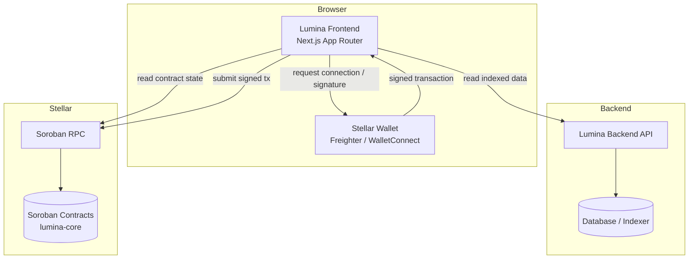
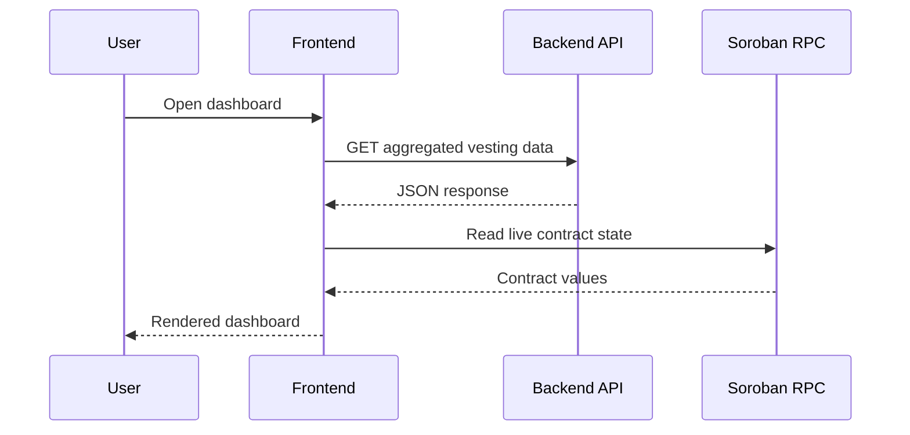
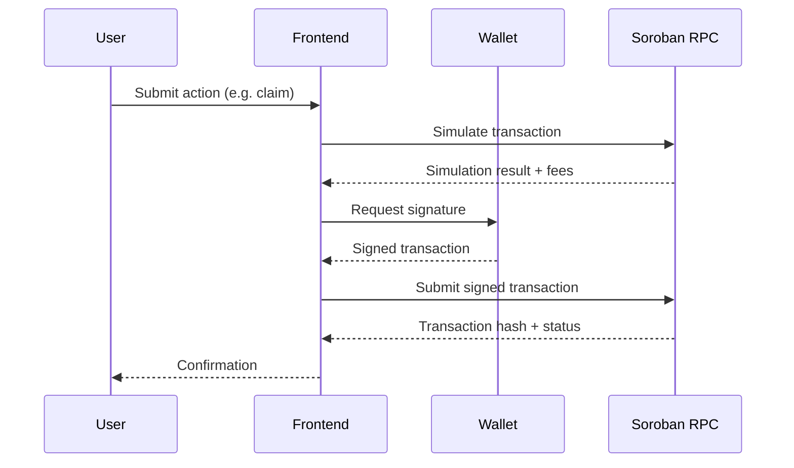
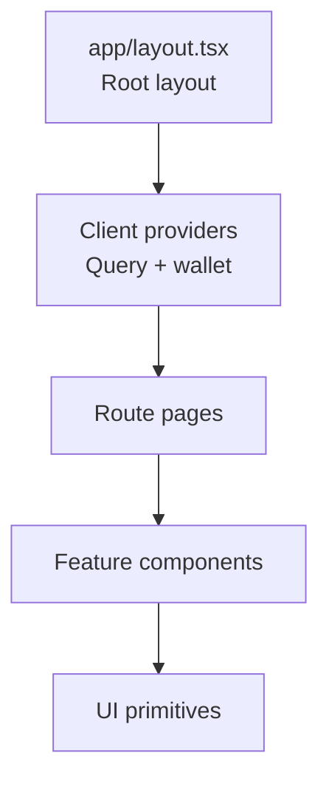

# Architecture

This document explains how Lumina Frontend is structured, how data flows through the system, and how the application connects to the backend API and to Stellar Soroban contracts.

## System overview

Lumina Frontend is a Next.js 16 App Router application. It is one of three repositories that make up the Lumina Network:

- **lumina-frontend** (this repo): the web dashboard.
- **lumina-backend**: the Node.js API that serves indexed data and off-chain services.
- **lumina-core**: the Soroban smart contracts that hold on-chain state.



## Design principles

1. **Non-custodial.** The frontend never sees or stores private keys. Signing always happens inside the user's wallet.
2. **Read from the fastest source.** Aggregated or historical data is read from the backend API, which indexes chain events. Live contract state is read directly from Soroban RPC.
3. **Server Components by default.** Rendering happens on the server unless a component needs interactivity, in which case it opts in with `"use client"`.
4. **Typed boundaries.** Every external boundary (API responses, contract return values) is given an explicit TypeScript type so changes surface at compile time.

## Data flow

### Reads



### Writes (transactions)



## Layered structure

The application is organized in layers, from the route surface down to external integrations. As features are added, code is expected to land in these layers:

| Layer | Location | Responsibility |
|-------|----------|----------------|
| Routes | `app/` | Pages, layouts, and route handlers (App Router). |
| UI components | `components/` | Reusable presentational and interactive components. |
| Hooks | `hooks/` | React hooks for data fetching, wallet, and UI state. |
| Services | `services/` | API client and Soroban contract clients. |
| Library | `lib/` | Framework-agnostic helpers, types, and configuration. |
| State | `stores/` | Zustand stores for cross-cutting client state. |

See [STATE_MANAGEMENT.md](STATE_MANAGEMENT.md) for how client state and server state are split, and [API_INTEGRATION.md](API_INTEGRATION.md) and [SOROBAN_INTEGRATION.md](SOROBAN_INTEGRATION.md) for the integration layers.

## Project structure

Routes live in `app/` (App Router). Everything else lives under `src/`, split into shared layers and self-contained feature modules.

```
app/                      # Routes, layouts, and route handlers (App Router)
src/
├── components/           # Shared UI, not tied to any one feature
│   ├── ui/               # Primitives (Button, Card, Modal, Table, …)
│   └── layout/           # App shell (Header, Sidebar, …)
├── features/             # Self-contained feature modules
│   ├── vesting/          # Vesting dashboard
│   ├── streaming/        # Token streaming
│   ├── wallet/           # Wallet connection & SEP-10 auth
│   └── admin/            # Admin panel
├── hooks/                # Shared React hooks
├── services/             # API client + Soroban contract clients
├── providers/            # Client context providers (React Query, …)
├── stores/               # Zustand stores (cross-cutting client state)
├── lib/                  # Framework-agnostic helpers (format, errors, a11y, …)
├── utils/                # Curated re-exports of lib helpers for app code
├── config/               # App configuration & design tokens (theme, soroban)
├── constants/            # Enums and constant values
└── types/                # Shared TypeScript types
```

### Feature modules

Each feature is a vertical slice that owns its own UI, data hooks, and types:

```
features/<feature>/
├── components/   # Feature UI
├── hooks/        # Data fetching & feature state
├── types/        # Feature-local types
└── index.ts      # Public API — the only entry point other code imports
```

A feature's `index.ts` re-exports its sub-barrels (`components`, `hooks`, `types`). Code outside a feature imports **only** from `@/features/<feature>`; it must not reach into a feature's internal files. Shared code (under `components/`, `hooks/`, `lib/`, …) must not import from a feature, keeping dependencies pointing one way: `app → features → shared`.

### Barrels and public APIs

Every module directory exposes a barrel `index.ts` that defines its public API. Import from the barrel (`@/components/ui`, `@/features/wallet`, `@/services`), not from deep paths. This keeps call sites stable when internal files are renamed or split.

### Path aliases

`tsconfig.json` maps `@/*` to the repo root, plus dedicated aliases for each layer so imports read by intent rather than by relative depth:

| Alias | Resolves to |
|-------|-------------|
| `@/components/*` | `src/components/*` |
| `@/features/*` | `src/features/*` |
| `@/hooks/*` | `src/hooks/*` |
| `@/services/*` | `src/services/*` |
| `@/stores/*` | `src/stores/*` |
| `@/lib/*` | `src/lib/*` |
| `@/config/*`, `@/constants/*`, `@/types/*`, `@/utils/*` | matching `src/*` |

### Import ordering

`eslint-plugin-import` enforces a consistent order (`eslint.config.mjs`): Node built-ins, then external packages, then internal modules — with feature and component imports grouped first among internals — separated by blank lines and alphabetized. Run `npm run lint`; most ordering issues auto-fix with `eslint --fix`.

## Component hierarchy



The root layout in [`app/layout.tsx`](../app/layout.tsx) wraps every route. Client-side providers (React Query client, wallet context) are mounted near the root so that all routes share a single query cache and wallet session. See [COMPONENT_GUIDE.md](COMPONENT_GUIDE.md) for the UI primitives.

## Network configuration

The active network is controlled by `NEXT_PUBLIC_NETWORK` and the RPC endpoint by `NEXT_PUBLIC_SOROBAN_RPC_URL`. Contract addresses are resolved per network; see [SOROBAN_INTEGRATION.md](SOROBAN_INTEGRATION.md) for the address table and the lookup pattern.

## Diagram sources

The Mermaid sources for these diagrams are kept under [diagrams/](diagrams/) so they can be edited and rendered independently.
