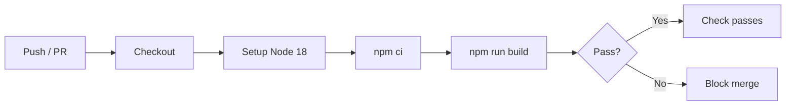
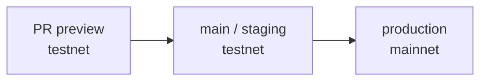

# Deployment

This document describes how Lumina Frontend is built, deployed, promoted across environments, and rolled back.

## Build output

Lumina Frontend is a Next.js 16 application. A production build is produced with:

```bash
npm ci
npm run build
```

The build runs ESLint and TypeScript checks, compiles the app with Turbopack, and outputs an optimized, mostly statically rendered bundle.

## Continuous integration

The CI pipeline lives in [`.github/workflows/test.yml`](../.github/workflows/test.yml). It runs on every push to `main` and on every pull request:



As the test suite grows, add `npm run lint` and `npm run test` steps before the build so failures are caught early. See [TESTING.md](TESTING.md).

## Environments

| Environment | Branch | Network | Purpose |
|-------------|--------|---------|---------|
| Preview | feature branches / PRs | testnet | Per-PR preview deploys for review. |
| Staging | `main` | testnet | Integration testing before release. |
| Production | release tag | mainnet | Live application. |

Each environment sets its own values for the `NEXT_PUBLIC_*` variables documented in the [README](../README.md#environment-variables). Production points at mainnet RPC and contract addresses; preview and staging point at testnet.

## Deploying with Vercel

The application targets [Vercel](https://vercel.com/), the native host for Next.js.

1. Connect the repository to a Vercel project.
2. Configure environment variables per environment (Production, Preview) in the Vercel dashboard.
3. Pushes to `main` deploy to staging; production deploys are promoted from a release.

Preview deployments are created automatically for every pull request, giving reviewers a live URL.

## Environment promotion



1. Merge a reviewed PR into `main`. This updates staging.
2. Validate on staging against testnet.
3. Tag a release (`vX.Y.Z`) and promote that build to production.
4. Update [CHANGELOG.md](../CHANGELOG.md) for the release.

## Rollback

If a production deploy introduces a regression:

1. **Immediate:** in the Vercel dashboard, promote the previous successful deployment back to production. This is instant and requires no rebuild.
2. **Source fix:** open a `fix/` branch, correct the issue, and follow the normal PR and promotion flow.
3. **Record:** note the rollback and the follow-up fix in [CHANGELOG.md](../CHANGELOG.md).

Because each deployment is immutable and addressable, rolling back is a promotion of a known-good build rather than a code revert, which keeps recovery fast.

## Pre-deploy checklist

- [ ] `npm run lint` passes.
- [ ] `npm run build` succeeds locally.
- [ ] Environment variables are set for the target environment.
- [ ] The correct network is configured (`NEXT_PUBLIC_NETWORK`).
- [ ] `CHANGELOG.md` is updated for the release.
