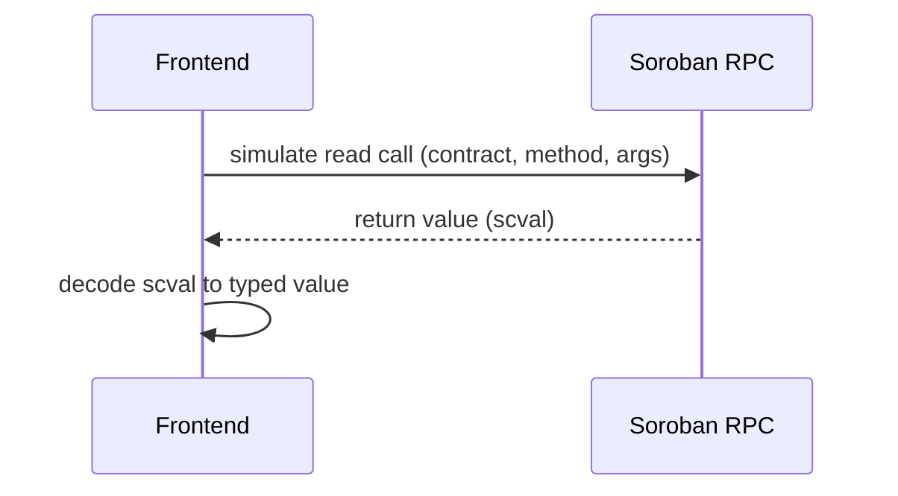
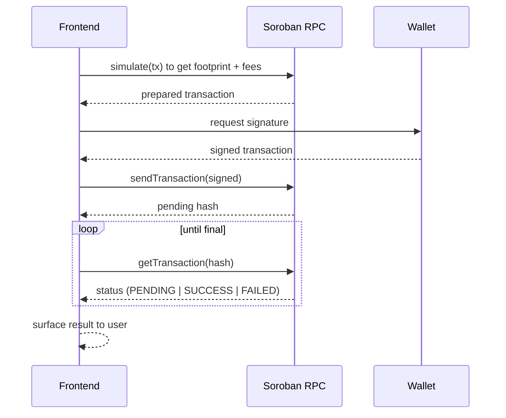

# Soroban Integration

This document describes how Lumina Frontend reads from and writes to Stellar Soroban smart contracts: contract address resolution per network, the query pattern for reads, and the transaction flow for writes.

## Background

[Soroban](https://soroban.stellar.org/) is Stellar's smart contract platform. The frontend interacts with it through a Soroban RPC endpoint (`NEXT_PUBLIC_SOROBAN_RPC_URL`) using the `@stellar/stellar-sdk`. Contract source lives in the `lumina-core` repository.

## Contract addresses per network

Contract IDs differ by network. Resolve them from a single map keyed by the active network so no address is hard-coded at a call site.

```ts
// lib/contracts.ts
type Network = "testnet" | "futurenet" | "mainnet";

const CONTRACTS: Record<Network, { vesting: string; governance: string }> = {
  testnet: {
    vesting: "C...TESTNET_VESTING_ID",
    governance: "C...TESTNET_GOVERNANCE_ID",
  },
  futurenet: {
    vesting: "C...FUTURENET_VESTING_ID",
    governance: "C...FUTURENET_GOVERNANCE_ID",
  },
  mainnet: {
    vesting: "C...MAINNET_VESTING_ID",
    governance: "C...MAINNET_GOVERNANCE_ID",
  },
};

const NETWORK = (process.env.NEXT_PUBLIC_NETWORK ?? "testnet") as Network;

/**
 * Resolve a contract ID for the active network.
 *
 * @param name - Logical contract name, e.g. "vesting".
 * @returns The deployed contract ID for the current network.
 */
export function contractId(name: keyof (typeof CONTRACTS)["testnet"]): string {
  return CONTRACTS[NETWORK][name];
}
```

> Replace the placeholder IDs above with the real deployed addresses from `lumina-core`. Keep this table as the single source of truth.

## Reading contract state

Reads are performed by simulating a contract call against Soroban RPC. No signature is required, so reads are cheap and safe.



Wrap reads in React Query so results are cached alongside API data (see [API_INTEGRATION.md](API_INTEGRATION.md)):

```ts
// hooks/use-vault-status.ts
/**
 * Read the on-chain vault status for an account from the vesting contract.
 *
 * @param account - Stellar account public key (G...).
 */
export function useVaultStatus(account: string) {
  return useQuery({
    queryKey: ["soroban", "vault-status", account],
    queryFn: () => readVaultStatus(account),
    enabled: Boolean(account),
  });
}
```

## Writing: transaction flow

A state-changing call follows simulate, sign, submit, poll. The wallet performs the signature (see [WALLET_INTEGRATION.md](WALLET_INTEGRATION.md)).



Steps in detail:

1. **Build.** Construct the contract invocation with the correct network passphrase.
2. **Simulate.** Ask RPC to simulate the call; this returns the resource footprint and fee estimate, and surfaces errors before the user signs.
3. **Sign.** Send the prepared transaction to the wallet for signature.
4. **Submit.** Send the signed transaction to RPC.
5. **Poll.** Poll `getTransaction` until the status is `SUCCESS` or `FAILED`.
6. **Reflect.** On success, invalidate the related React Query keys so the UI updates.

## Decoding values

Soroban returns values as `scval`. Always decode into an explicit TypeScript type at the boundary so contract changes are caught at compile time rather than at runtime.

## Conventions summary

- Resolve every contract ID through `contractId()`; never inline an address.
- Always simulate before signing.
- Always include the correct network passphrase.
- Treat decoded contract values as typed data, not `any`.
- Invalidate React Query keys after a successful write.
