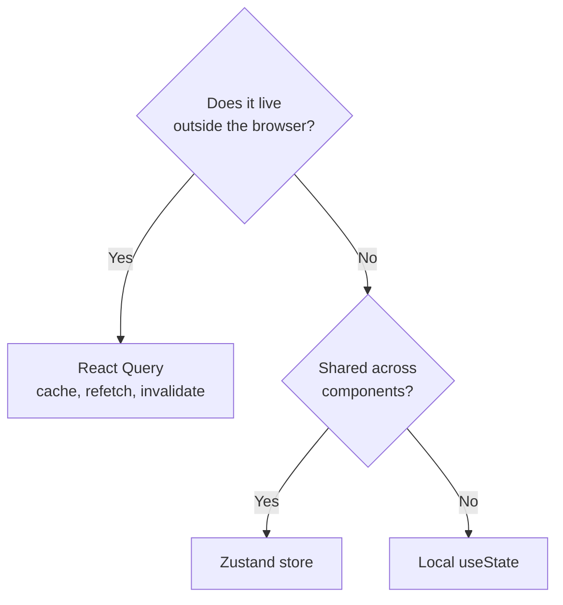

# State Management

This document explains how Lumina Frontend manages state. The core idea is a clear split between **server state** and **client state**, each handled by the tool best suited to it.

## Two kinds of state

| Kind | Examples | Tool |
|------|----------|------|
| Server state | API responses, contract reads, anything that lives elsewhere and can go stale | [React Query](https://tanstack.com/query) |
| Client state | Wallet session, UI toggles, modals, form drafts, theme | [Zustand](https://zustand.docs.pmnd.rs/) |

A simple test: if the data has a source of truth outside the browser (the API or the chain), it is server state and belongs in React Query. If it only exists in the current session, it is client state and belongs in a Zustand store or local component state.



## Server state: React Query

React Query owns all data fetched from the backend API and from Soroban RPC. It provides caching, deduplication, background refetching, and consistent loading and error states.

- Query keys come from a central factory. See [API_INTEGRATION.md](API_INTEGRATION.md).
- One hook per resource, colocated under `hooks/`.
- Mutations invalidate the affected keys on success so the UI stays in sync.

Do not copy server data into a Zustand store. Read it from React Query where it is needed; the cache is the single source of truth.

## Client state: Zustand

Zustand holds small, app-wide client state. Stores are plain hooks with no provider boilerplate.

```ts
// stores/wallet-store.ts
import { create } from "zustand";

type WalletStatus = "disconnected" | "connecting" | "connected" | "authenticated";

interface WalletState {
  status: WalletStatus;
  publicKey: string | null;
  setConnected: (publicKey: string) => void;
  disconnect: () => void;
}

/**
 * Global wallet session state. Holds connection status and the active
 * public key. Never stores private keys.
 */
export const useWalletStore = create<WalletState>((set) => ({
  status: "disconnected",
  publicKey: null,
  setConnected: (publicKey) => set({ status: "connected", publicKey }),
  disconnect: () => set({ status: "disconnected", publicKey: null }),
}));
```

Usage with a selector so components only re-render when the slice they read changes:

```tsx
const status = useWalletStore((s) => s.status);
const disconnect = useWalletStore((s) => s.disconnect);
```

### Guidelines for stores

- Keep stores small and focused on one concern (wallet, UI, preferences).
- Select narrow slices, not the whole store, to avoid extra re-renders.
- Keep derived values in selectors or components, not duplicated in state.
- Never store secrets or private keys.

## Local state

For state that only one component needs (an open or closed dropdown, a controlled input), use `useState` or `useReducer`. Do not promote it to a store until more than one component genuinely needs it.

## Decision guide

1. Comes from the API or chain? Use React Query.
2. Shared across components and session-only? Use a Zustand store.
3. Used by a single component? Use local `useState`.

Following this split keeps the cache authoritative for remote data and keeps client stores small and predictable.
