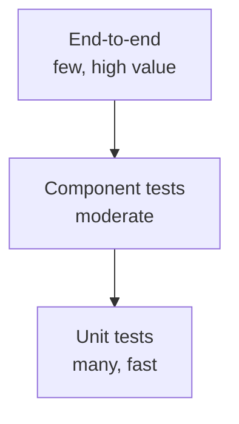

# Testing

This document describes the testing strategy for Lumina Frontend: the layers of tests, the recommended tools, and how to write each kind.

## Testing pyramid



Favor many fast unit tests, a moderate number of component tests, and a small number of end-to-end tests covering the most important user journeys.

## Tools

| Layer | Recommended tool |
|-------|------------------|
| Unit | [Vitest](https://vitest.dev/) |
| Component | [React Testing Library](https://testing-library.com/docs/react-testing-library/intro/) with Vitest |
| End-to-end | [Playwright](https://playwright.dev/) |

Suggested scripts to add to `package.json` when tests are introduced:

```jsonc
{
  "scripts": {
    "test": "vitest run",
    "test:watch": "vitest",
    "test:e2e": "playwright test"
  }
}
```

## Unit tests

Test pure functions and helpers in isolation. These are the fastest tests and should cover edge cases thoroughly.

```ts
// lib/format.test.ts
import { describe, it, expect } from "vitest";
import { formatAmount } from "./format";

describe("formatAmount", () => {
  it("formats whole numbers with grouping", () => {
    expect(formatAmount(1000000)).toBe("1,000,000");
  });

  it("handles zero", () => {
    expect(formatAmount(0)).toBe("0");
  });
});
```

## Component tests

Render a component and assert on what the user sees and does. Query by role and text, not by implementation details such as class names.

```tsx
// components/ui/button.test.tsx
import { render, screen } from "@testing-library/react";
import userEvent from "@testing-library/user-event";
import { describe, it, expect, vi } from "vitest";
import { Button } from "./button";

describe("Button", () => {
  it("calls onClick when pressed", async () => {
    const onClick = vi.fn();
    render(<Button onClick={onClick}>Connect</Button>);
    await userEvent.click(screen.getByRole("button", { name: "Connect" }));
    expect(onClick).toHaveBeenCalledOnce();
  });
});
```

For components that use React Query or the wallet store, wrap them in the needed providers in a shared test helper so each test stays focused.

## Mocking external boundaries

- **API calls:** mock the network layer (for example with [MSW](https://mswjs.io/)) so tests do not hit a real backend.
- **Soroban RPC:** mock the service functions that wrap RPC; do not call a live network in tests.
- **Wallet:** mock the wallet store and signing functions to simulate connected, disconnected, and rejected states.

## End-to-end tests

Drive a real browser through full journeys: connect wallet (mocked signer), view dashboard, submit an action, see confirmation.

```ts
// e2e/dashboard.spec.ts
import { test, expect } from "@playwright/test";

test("home page loads", async ({ page }) => {
  await page.goto("/");
  await expect(page).toHaveTitle(/Lumina/i);
});
```

## What to test

- **Always:** business logic, formatting, state transitions, error handling, accessibility of interactive elements.
- **Sometimes:** complex component behavior with many states.
- **Rarely:** third-party library internals or trivial passthrough props.

## In CI

Add the test commands to the CI workflow alongside the existing build step so every pull request runs lint, tests, and build. See [DEPLOYMENT.md](DEPLOYMENT.md) for the pipeline.
