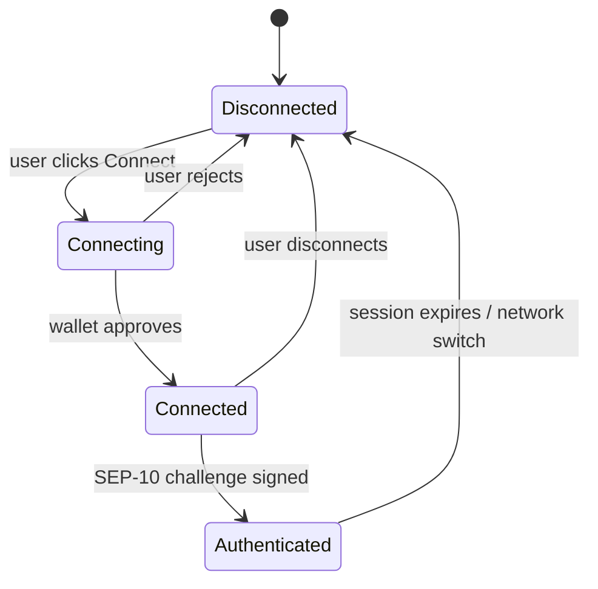
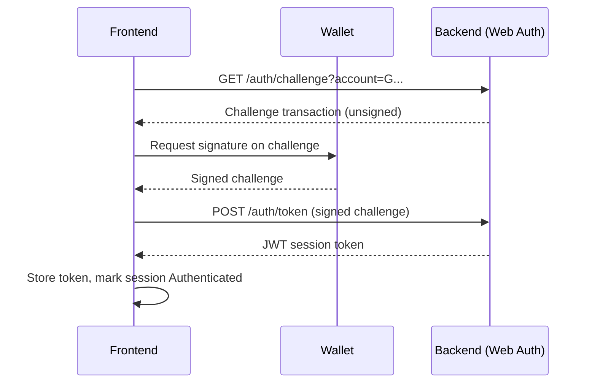

# Wallet Integration

This document describes how Lumina Frontend connects to Stellar wallets, authenticates users with SEP-10, and handles networks. The frontend is non-custodial: it never holds keys and delegates all signing to the user's wallet.

## Supported wallets

| Wallet | Mechanism | Notes |
|--------|-----------|-------|
| [Freighter](https://www.freighter.app/) | Browser extension | Primary desktop wallet. |
| WalletConnect | Session via `NEXT_PUBLIC_WALLET_CONNECT_PROJECT_ID` | For mobile and cross-device signing. |

## Connection lifecycle

1. **Disconnected.** No wallet is linked. The UI shows a Connect button.
2. **Connecting.** The app asks the wallet for the user's public key.
3. **Connected.** The public key is known. Read-only contract interactions are possible.
4. **Authenticated.** The user has completed the SEP-10 flow and holds a session token for backend calls that require identity.

## SEP-10 authentication flow

[SEP-10](https://github.com/stellar/stellar-protocol/blob/master/ecosystem/sep-0010.md) is the Stellar standard for proving control of an account by signing a server-issued challenge. Lumina uses it to issue a session token from the backend without ever exposing a private key.

The token is attached to authenticated backend requests. See [API_INTEGRATION.md](API_INTEGRATION.md) for how the API client adds the auth header.

## Network handling

The active network is read from environment variables:

| Variable | Purpose |
|----------|---------|
| `NEXT_PUBLIC_NETWORK` | `testnet`, `futurenet`, or `mainnet`. |
| `NEXT_PUBLIC_SOROBAN_RPC_URL` | RPC endpoint for the active network. |

Each network has its own [network passphrase](https://developers.stellar.org/docs/learn/fundamentals/networks). The passphrase is required when building and signing transactions so a signature for one network cannot be replayed on another:

| Network | Passphrase |
|---------|-----------|
| Testnet | `Test SDF Network ; September 2015` |
| Futurenet | `Test SDF Future Network ; October 2022` |
| Mainnet | `Public Global Stellar Network ; September 2015` |

### Network mismatch

If the wallet is set to a different network than `NEXT_PUBLIC_NETWORK`, the app should block signing and prompt the user to switch. Treat any change in the wallet's selected network as a reason to clear the current session and return to the Disconnected state.

## Security notes

- The frontend never requests, stores, or transmits a private key or seed phrase.
- Session tokens are short-lived. Re-run the SEP-10 flow when a token expires.
- Always show the user the human-readable effects of a transaction before requesting a signature. See the transaction flow in [SOROBAN_INTEGRATION.md](SOROBAN_INTEGRATION.md).
